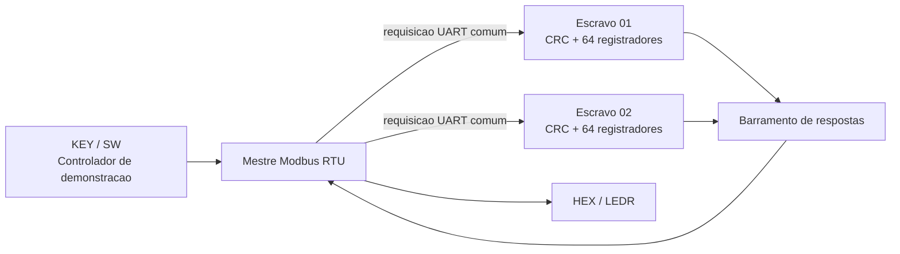

# Modbus RTU multi-escravo na DE10-Standard

## Arquitetura

O projeto implementa um mestre e dois escravos Modbus RTU inteiramente dentro
do Cyclone V da DE10-Standard:

- escravo 1: endereco `0x01`;
- escravo 2: endereco `0x02`;
- endereco `0x03`: nao instanciado, reservado para o teste de timeout;
- cada escravo possui UART RX/TX, temporizador de quadro, CRC e banco proprio
  com 64 holding registers.

O quadro transmitido pelo mestre chega aos dois escravos. Cada escravo valida o
CRC e o endereco, mas somente o escravo enderecado produz uma resposta. As
saidas UART, ociosas em nivel alto, sao combinadas em um barramento interno
compartilhado.



`modbus_top_level` possui o parametro `NUM_SLAVES`, cujo valor padrao e `1`.
`slave_id` representa o primeiro endereco; os demais sao consecutivos. A
demonstracao usa `NUM_SLAVES=2` e `slave_id=8'h01`.

## Preparacao da placa

Hardware utilizado:

- FPGA Cyclone V SE `5CSXFC6D6F31C6N`;
- `CLOCK_50` de 50 MHz no pino `AF14`;
- teclas ativas em nivel baixo;
- dez chaves, dez LEDs e seis displays de sete segmentos.

Procedimento:

1. Abra `de10_standard_modbus.qpf` no Quartus.
2. Confirme `de10_standard_modbus_demo` como **Top-Level Entity**.
3. Execute **Processing > Start Compilation**.
4. Abra **Tools > Programmer** e selecione USB-Blaster II.
5. Carregue `output_files/de10_standard_modbus.sof`.
6. Pressione `KEY0` para reiniciar a demonstracao.

O arquivo QSF continua usando os mesmos pinos. Nenhuma conexao externa ou
transceptor RS-485 e necessaria para esta demonstracao interna.

## Controles

| Controle | Funcao |
| --- | --- |
| `KEY0` | reset |
| `KEY1` | FC06 manual no registrador 2 |
| `KEY2` | FC03 manual no registrador 2 |
| `KEY3` | iniciar o autoteste ou avancar no modo guiado |
| `SW9=0` | autoteste guiado |
| `SW9=1` | autoteste automatico |
| `SW8=0` | selecionar escravo `0x01` no modo manual |
| `SW8=1` | selecionar escravo `0x02` no modo manual |
| `SW7:0` | dado da operacao manual e semente do autoteste |

No modo manual, `KEY1` grava `0x00VV`, onde `VV=SW7:0`. `KEY2` le o mesmo
registrador. Isso permite escrever valores diferentes nos dois escravos,
alternando `SW8`, e depois comprovar que os bancos sao independentes.

## Displays e LEDs

- `HEX5`: escravo selecionado (`1` ou `2`) no modo manual; etapa de `1` a `D`
  durante e depois do autoteste.
- `HEX4`: status retornado.
- `HEX3..HEX0`: dado de 16 bits ou `0002`/`0003` nas excecoes.

| Status em HEX4 | Significado |
| --- | --- |
| `0` | operacao aprovada |
| `1` | resposta de excecao Modbus |
| `2` | erro de CRC na resposta |
| `3` | timeout |
| `4` | estado inicial/resposta invalida |
| `5` | overflow |
| `6` | funcao rejeitada localmente |
| `7` | parametro rejeitado localmente |

| LED | Indicacao |
| --- | --- |
| `LEDR0` | mestre ocupado |
| `LEDR1` | resposta concluida |
| `LEDR2` | ultima resposta com `STATUS_OK` |
| `LEDR3` | autoteste em execucao |
| `LEDR4` | autoteste concluido |
| `LEDR5` | todos os testes aprovados |
| `LEDR6` | falha; `HEX5` conserva a etapa |
| `LEDR7` | colisao entre transmissores; permanece aceso ate o reset |
| `LEDR8` | atividade mestre para escravos |
| `LEDR9` | atividade escravos para mestre |

## Fluxo automatico e guiado

Ao pressionar `KEY3`, os valores ficam congelados para todo o fluxo:

- escravo 1: `0x10VV`, com `VV=SW7:0`;
- escravo 2: `0x20NN`, com `NN=~SW7:0`;
- registrador 3 do escravo 1: `0x30XX`, com `XX=SW7:0 XOR A5`.

| Etapa | Operacao | Resultado esperado |
| --- | --- | --- |
| `1` | FC06 escreve `0x10VV` em S1:R2 | status `0`, eco `0x10VV` |
| `2` | FC03 le S1:R2 | status `0`, dado `0x10VV` |
| `3` | FC06 escreve `0x20NN` em S2:R2 | status `0`, eco `0x20NN` |
| `4` | FC03 le S2:R2 | status `0`, dado `0x20NN` |
| `5` | rele S1:R2 | confirma que continua `0x10VV` |
| `6` | rele S2:R2 | confirma que continua `0x20NN` |
| `7` | FC06 escreve `0x30XX` em S1:R3 | status `0` |
| `8` | FC03 le S1:R2 e S1:R3 | dois registradores corretos |
| `9` | FC06 em S1:endereco 64 | excecao `02` |
| `A` | FC03 em S2:endereco 63, quantidade 2 | excecao `02` |
| `B` | FC03 em S2 com quantidade 14 | excecao `03` |
| `C` | funcao `10h` e depois FC03 com quantidade zero | status `6` e depois `7` |
| `D` | FC03 para o endereco inexistente `0x03` | status `3` (timeout) |

Em `SW9=0`, pressione `KEY3` para avancar depois de analisar cada resultado.
Na etapa `C`, sao necessarios dois avancos porque ha dois testes locais. Esse e
o modo recomendado para a apresentacao.

Em `SW9=1`, cada resultado permanece por dois segundos. O fluxo leva
aproximadamente 26 segundos, alem do timeout final. Ao terminar corretamente,
`LEDR4` e `LEDR5` ficam acesos; `LEDR6` e `LEDR7` permanecem apagados.

Exemplo com `SW7:0=A5`:

| Etapa | Conteudo dos seis displays `HEX5..HEX0` |
| --- | --- |
| `1`, `2`, `5` | `10 10A5` |
| `3`, `4`, `6` | `30 205A` |
| `7` | `70 3000` |
| `8` | `80 10A5` |
| `9` | `91 0002` |
| `A` | `A1 0002` |
| `B` | `B1 0003` |
| `C`, primeiro resultado | `C6 0000` |
| `C`, segundo resultado | `C7 0000` |
| `D` | `D3 0000` |

## Simulacoes no ModelSim

Regressao original de um escravo:

```tcl
do run_modbus_top_level_tb.do
```

Integracao de dois escravos, incluindo isolamento, excecoes e timeout:

```tcl
do run_modbus_multi_slave_tb.do
```

Descarte de requisicao com CRC propositalmente invalido:

```tcl
do run_modbus_bad_crc_tb.do
```

Fluxo automatico completo do controlador da placa:

```tcl
do run_de10_standard_modbus_demo_tb.do
```

O waveform multi-escravo separa os sinais dos escravos 1 e 2 e mostra
`slave_tx_serial`, `slave_uart_tx_busy` e `slave_bus_collision`. Durante uma
requisicao, ambos recebem os bytes; somente o escravo cujo endereco coincide
entra na transmissao.

## Observacao sobre RS-485

O projeto atual e um barramento serial interno sintetizado no FPGA. Para
conectar equipamentos Modbus RTU externos, nao ligue A/B diretamente ao FPGA:
e necessario um transceptor RS-485 de 3,3 V, como o MAX3485, e controle de
direcao. Essa interface externa nao faz parte desta demonstracao.
