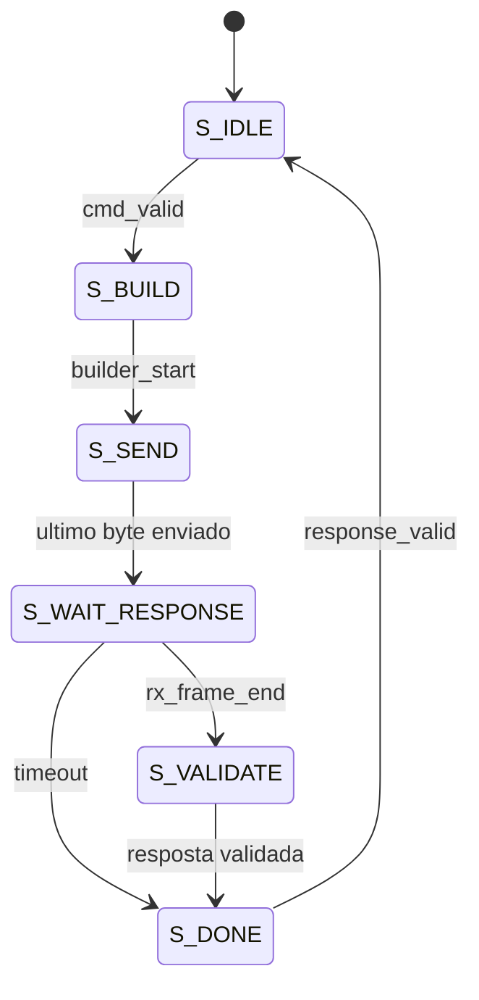

# Explicação Didática do Mestre Modbus RTU em SystemVerilog

## 1. Visão geral

Este documento explica, de forma didática e com linguagem adequada para apresentação acadêmica, o funcionamento do mestre Modbus RTU desenvolvido em SystemVerilog. O objetivo é permitir que o código seja compreendido, apresentado e defendido diante de colegas, professores e avaliadores.

O conjunto desenvolvido é formado por arquivos de implementação, verificação e documentação:

- `modbus_defs_pkg.sv`: pacote com códigos de função, limite de leitura e enum de status.
- `modbus_crc_pkg.sv`: pacote compartilhado com a função de cálculo do CRC Modbus RTU.
- `master_frame_builder.sv`: responsável por montar o quadro de requisição Modbus RTU.
- `modbus_master_fsm.sv`: responsável por controlar a máquina de estados do mestre.
- `tb_modbus_master_fsm.sv`: responsável por verificar o funcionamento do mestre por meio de simulação.
- `README_MESTRE_MODBUS_RTU.md`: guia técnico curto para compilação, integração e entrega.
- `TABELA_VERIFICACAO_MESTRE_MODBUS_RTU.md`: tabela de cenários de teste para uso no relatório.
- `ROTEIRO_APRESENTACAO_MESTRE_MODBUS_RTU.md`: roteiro curto para apresentação oral.
- `TRECHO_RELATORIO_MESTRE_MODBUS_RTU.md`: texto acadêmico pronto para metodologia e verificação.

Em uma rede Modbus RTU, o mestre é o dispositivo que inicia a comunicação. Ele envia uma requisição para um escravo específico, aguarda a resposta, verifica se a resposta está correta e então informa o resultado da transação. No projeto desenvolvido, esse comportamento foi modelado em hardware, usando lógica sequencial, sinais de controle e máquina de estados finitos.

Uma forma simples de entender o mestre é compará-lo a um programa Java que executa uma sequência controlada de passos:

```java
montarRequisicao();
enviarBytes();
aguardarResposta();
validarCRC();
validarConteudo();
retornarStatus();
```

Em SystemVerilog, entretanto, esse fluxo não acontece como uma função comum de software. Ele acontece ciclo a ciclo, sincronizado pelo sinal de clock. Por isso, a máquina de estados é tão importante: ela define em qual etapa o hardware está em cada instante.

## 2. Conceitos abordados no código

### 2.1 Modbus RTU

O Modbus RTU é um protocolo de comunicação industrial baseado em troca de quadros. Cada quadro contém campos bem definidos, como endereço do escravo, código da função, dados e CRC. O mestre envia uma requisição, e apenas o escravo endereçado deve responder.

Neste projeto, foram consideradas duas funções Modbus:

- Função `03`: leitura de registradores do tipo Holding Register.
- Função `06`: escrita de um único registrador.

Essas duas funções são bastante utilizadas em aplicações industriais, pois permitem consultar e alterar valores internos de dispositivos, como sensores, controladores, inversores ou módulos de entrada e saída.

### 2.2 Estrutura do quadro de requisição

Para as funções `03` e `06`, a requisição possui 8 bytes:

| Índice | Campo | Descrição |
|---:|---|---|
| 0 | Endereço do escravo | Identifica qual escravo deve responder |
| 1 | Código da função | Indica a operação solicitada, como `03` ou `06` |
| 2 | Endereço alto | Parte mais significativa do endereço do registrador |
| 3 | Endereço baixo | Parte menos significativa do endereço do registrador |
| 4 | Valor/quantidade alto | Quantidade de registradores ou valor a escrever |
| 5 | Valor/quantidade baixo | Parte menos significativa do campo anterior |
| 6 | CRC baixo | Primeiro byte do CRC Modbus RTU |
| 7 | CRC alto | Segundo byte do CRC Modbus RTU |

Um ponto importante é que o protocolo Modbus RTU transmite o CRC com o byte menos significativo primeiro. Por isso, o código envia `crc[7:0]` antes de `crc[15:8]`.

### 2.3 CRC Modbus RTU

O CRC é um mecanismo de detecção de erro. Ele não corrige automaticamente a mensagem, mas permite verificar se algum bit foi alterado durante a transmissão.

No código, o CRC é iniciado com `16'hFFFF` e atualizado byte a byte com o polinômio `16'hA001`, que é o polinômio usado no Modbus RTU. A função `crc16_update` aparece no construtor de quadros, na FSM e no testbench, sempre com a mesma finalidade: atualizar o valor do CRC a partir de um byte recebido ou transmitido.

Na validação da resposta, o código processa todos os bytes recebidos, inclusive os dois bytes de CRC. Quando uma mensagem Modbus RTU válida é processada dessa forma, o resultado final do CRC deve ser `16'h0000`. Por isso, a FSM verifica:

```systemverilog
response_crc != 16'h0000
```

Se o valor final for diferente de zero, a resposta é classificada como erro de CRC.

### 2.4 Máquina de estados finitos

A máquina de estados finitos, ou FSM, organiza o comportamento do mestre em etapas. Em vez de tentar fazer tudo ao mesmo tempo, o hardware passa por estados bem definidos:

- `S_IDLE`: aguarda um novo comando.
- `S_BUILD`: inicia a montagem do quadro.
- `S_SEND`: envia os bytes da requisição.
- `S_WAIT_RESPONSE`: aguarda a resposta do escravo.
- `S_VALIDATE`: valida a resposta recebida.
- `S_DONE`: informa que a transação terminou.

Essa organização facilita a implementação em FPGA, pois cada estado possui uma responsabilidade clara.



## 3. Explicação do arquivo `master_frame_builder.sv`

O módulo `master_frame_builder` é responsável por montar e fornecer, byte a byte, a requisição Modbus RTU que será enviada pelo mestre.

Ele recebe os seguintes campos:

- `slave_addr`: endereço do escravo.
- `function_code`: função Modbus desejada.
- `register_addr`: endereço do registrador.
- `value_or_quantity`: valor a escrever ou quantidade de registradores a ler.

A saída principal é `frame_byte`, que representa o byte atual do quadro. O índice desse byte é indicado por `frame_index`.

### 3.1 Entradas e saídas principais

O sinal `start` inicia a montagem do quadro. Quando `start` é ativado e o módulo não está ocupado, os campos de entrada são armazenados internamente no vetor `frame`.

O sinal `busy` indica que o construtor está em operação. Enquanto `busy` estiver ativo, o módulo apresenta bytes válidos na saída.

O sinal `frame_valid` indica que `frame_byte` contém um byte válido. No código atual, ele é igual a `busy`:

```systemverilog
frame_valid = busy;
```

O sinal `frame_ready` vem do bloco transmissor. Ele informa que o próximo estágio está pronto para receber o byte atual. Esse sinal é essencial porque evita que bytes sejam perdidos quando a UART ou o meio de transmissão não está pronto.

### 3.2 Montagem dos seis primeiros bytes

Quando o módulo recebe `start`, os seis primeiros bytes são preenchidos assim:

```systemverilog
frame[0] <= slave_addr;
frame[1] <= function_code;
frame[2] <= register_addr[15:8];
frame[3] <= register_addr[7:0];
frame[4] <= value_or_quantity[15:8];
frame[5] <= value_or_quantity[7:0];
```

Isso segue a organização do Modbus RTU: primeiro o endereço do escravo, depois o código da função, depois os campos de dados. Os valores de 16 bits são divididos em byte alto e byte baixo.

### 3.3 Cálculo do CRC

O CRC é calculado em um bloco combinacional:

```systemverilog
crc = 16'hFFFF;
for (i = 0; i < 6; i++)
    crc = crc16_update(crc, frame[i]);
```

Isso significa que o CRC é calculado sobre os seis primeiros bytes do quadro. Os bytes 6 e 7 não são armazenados no vetor `frame`; eles são gerados diretamente a partir do valor calculado de CRC.

Quando `frame_index` vale `6`, a saída é o byte baixo do CRC. Quando `frame_index` vale `7`, a saída é o byte alto:

```systemverilog
3'd6: frame_byte = crc[7:0];
3'd7: frame_byte = crc[15:8];
```

### 3.4 Controle de avanço dos bytes

O índice `frame_index` só avança quando `frame_ready` está ativo. Isso implementa um handshake parecido com o padrão `valid/ready`, muito comum em projetos digitais.

Em termos simples:

- `frame_valid` significa: "eu tenho um byte disponível".
- `frame_ready` significa: "pode me entregar esse byte agora".
- quando os dois estão ativos, o byte é considerado transmitido.

Quando `frame_index` chega em `7` e o byte é aceito, `busy` volta para zero. Isso indica que todos os 8 bytes da requisição foram entregues.

## 4. Explicação do arquivo `modbus_master_fsm.sv`

O arquivo `modbus_master_fsm.sv` contém o controle principal do mestre Modbus RTU. Ele integra a montagem do quadro, o envio da requisição, a recepção da resposta, a validação e a geração do status final.

Esse módulo pode ser entendido como o "cérebro" do mestre.

### 4.1 Interface de comando

A interface de comando é formada por sinais como:

- `cmd_valid`: indica que existe um comando válido na entrada.
- `cmd_ready`: indica que o mestre está pronto para aceitar um novo comando.
- `cmd_slave_addr`: endereço do escravo.
- `cmd_function`: função Modbus.
- `cmd_register_addr`: endereço do registrador.
- `cmd_write_data`: dado usado na escrita com função `06`.
- `cmd_quantity`: quantidade de registradores usada na leitura com função `03`.

O mestre só aceita um comando quando está em `S_IDLE`, pois nesse estado não existe transação em andamento:

```systemverilog
assign cmd_ready = (state == S_IDLE);
```

### 4.2 Interface de transmissão

A transmissão usa os sinais:

- `tx_data`: byte a ser transmitido.
- `tx_valid`: indica que o byte é válido.
- `tx_ready`: indica que o transmissor pode receber o byte.

O sinal `tx_data` recebe diretamente o byte fornecido pelo `master_frame_builder`:

```systemverilog
assign tx_data = builder_byte;
```

O sinal `tx_valid` só fica ativo quando a FSM está no estado de envio e o construtor possui um byte válido:

```systemverilog
assign tx_valid = (state == S_SEND) && builder_valid;
```

### 4.3 Interface de recepção

A recepção usa os sinais:

- `rx_data`: byte recebido.
- `rx_valid`: indica que `rx_data` contém um byte válido.
- `rx_frame_end`: indica que o quadro recebido terminou.

Enquanto a FSM está em `S_WAIT_RESPONSE`, cada byte recebido é armazenado no vetor `response_buffer`. Ao mesmo tempo, o CRC da resposta é atualizado:

```systemverilog
response_buffer[response_length] <= rx_data;
response_length <= response_length + 1'b1;
response_crc <= crc16_update(response_crc, rx_data);
```

Assim, quando o fim do quadro é indicado por `rx_frame_end`, a FSM já possui todos os bytes necessários para validar a resposta.

### 4.4 Estado `S_IDLE`

O estado `S_IDLE` é o estado de repouso. Nele, o mestre aguarda um comando de entrada.

Quando `cmd_valid` é ativado, os dados do comando são armazenados em registradores internos:

```systemverilog
selected_slave    <= cmd_slave_addr;
selected_function <= cmd_function;
selected_register <= cmd_register_addr;
selected_value    <= (cmd_function == FC_READ_HOLDING)
                     ? cmd_quantity : cmd_write_data;
```

Esse armazenamento é importante porque os sinais de entrada podem mudar depois que a transação começa. A FSM precisa manter uma cópia estável dos parâmetros até a resposta ser validada.

### 4.5 Estado `S_BUILD`

No estado `S_BUILD`, a FSM ativa `builder_start` por um ciclo de clock. Isso sinaliza ao `master_frame_builder` que ele deve iniciar a montagem do quadro.

Depois disso, a FSM passa para `S_SEND`.

### 4.6 Estado `S_SEND`

No estado `S_SEND`, os bytes do quadro são enviados sequencialmente. A FSM acompanha o sinal `builder_index` para saber qual byte está sendo transmitido.

Quando o último byte, de índice `7`, é aceito pelo transmissor, a FSM limpa contadores e passa para `S_WAIT_RESPONSE`:

```systemverilog
if (builder_valid && tx_ready && builder_index == 3'd7) begin
    timeout_count   <= '0;
    response_length <= '0;
    response_crc    <= 16'hFFFF;
    state <= S_WAIT_RESPONSE;
end
```

### 4.7 Estado `S_WAIT_RESPONSE`

Esse estado aguarda a resposta do escravo. Se um byte chega, ele é armazenado, o CRC é atualizado e o contador de timeout é reiniciado.

Se nenhum byte chega por muitos ciclos, o contador `timeout_count` aumenta. Quando ele atinge `TIMEOUT_CYCLES-1`, a FSM considera que houve ausência de resposta:

```systemverilog
response_status <= STATUS_TIMEOUT;
state <= S_DONE;
```

O timeout é importante porque impede que o mestre fique travado esperando indefinidamente uma resposta que nunca chegará.

### 4.8 Estado `S_VALIDATE`

O estado `S_VALIDATE` verifica se a resposta recebida faz sentido. A validação ocorre em uma ordem lógica:

1. Verifica se o comprimento mínimo foi recebido.
2. Verifica se o CRC final é válido.
3. Verifica se o endereço do escravo é o esperado.
4. Verifica se a resposta é uma exceção Modbus.
5. Verifica se a função retornada é a mesma solicitada.
6. Aplica regras específicas para função `03`.
7. Aplica regras específicas para função `06`.

Para a função `03`, a resposta válida deve conter:

- endereço do escravo;
- código da função;
- quantidade de bytes retornados;
- dados dos registradores;
- CRC.

O código verifica se o byte count é diferente de zero, se é par e se o comprimento total do quadro está correto:

```systemverilog
if ((response_buffer[2] == 0) ||
    (response_buffer[2][0] != 0) ||
    (response_length != response_buffer[2] + 5)) begin
    response_status <= STATUS_INVALID;
end
```

Para a função `06`, o escravo deve ecoar o endereço do registrador e o valor escrito. Por isso, a FSM compara a resposta com os dados enviados na requisição.

### 4.9 Estado `S_DONE`

O estado `S_DONE` informa ao restante do sistema que a transação terminou. Para isso, ativa `response_valid` por um ciclo:

```systemverilog
response_valid <= 1'b1;
state <= S_IDLE;
```

Depois disso, a FSM retorna para `S_IDLE` e fica pronta para receber um novo comando.

### 4.10 Status de resposta

O módulo possui cinco status principais:

| Status | Significado |
|---:|---|
| `STATUS_OK` | A resposta foi validada com sucesso |
| `STATUS_EXCEPTION` | O escravo retornou uma exceção Modbus |
| `STATUS_CRC_ERROR` | O CRC da resposta está incorreto |
| `STATUS_TIMEOUT` | Nenhuma resposta chegou dentro do tempo limite |
| `STATUS_INVALID` | A resposta não respeita o formato esperado |

Esses status são fundamentais para transformar a comunicação em um resultado simples para o restante do sistema.

## 5. Explicação do arquivo `tb_modbus_master_fsm.sv`

O arquivo `tb_modbus_master_fsm.sv` é um testbench. Ele não é destinado à síntese em FPGA. Sua função é simular o comportamento do mestre e verificar se ele responde corretamente em diferentes situações.

Uma comparação útil com Java é pensar no testbench como um conjunto de testes unitários. Ele instancia o módulo principal, aplica estímulos, observa as saídas e usa `assert` para verificar se o resultado foi o esperado.

### 5.1 Clock e reset

O clock é gerado por:

```systemverilog
always #5 clk = ~clk;
```

Isso cria um clock que alterna a cada 5 ns, resultando em um período de 10 ns.

O reset começa em zero e depois é liberado:

```systemverilog
repeat (3) @(posedge clk); rst_n = 1'b1;
```

Como `rst_n` é ativo em nível baixo, o sistema inicia resetado e só começa a operar quando `rst_n` passa para `1`.

### 5.2 Captura da requisição transmitida

O testbench captura os bytes transmitidos pelo mestre sempre que `tx_valid` e `tx_ready` estão ativos:

```systemverilog
if (tx_valid && tx_ready) begin
    captured_request[captured_count] <= tx_data;
    captured_count <= captured_count + 1;
end
```

Isso permite confirmar que o mestre realmente enviou os 8 bytes da requisição antes de a resposta simulada ser aplicada.

### 5.3 Tarefa `issue_command`

A task `issue_command` simula a entrada de um comando no mestre. Ela espera o mestre ficar pronto, preenche os sinais de comando, ativa `cmd_valid` por um ciclo e aguarda a transmissão dos 8 bytes.

Essa task evita repetição de código no testbench e deixa os cenários de teste mais claros.

### 5.4 Tarefa `send_response`

A task `send_response` simula uma resposta vinda de um escravo Modbus. Ela recebe um payload, calcula o CRC, envia os bytes e depois sinaliza o fim do quadro com `rx_frame_end`.

Ela também permite corromper o CRC propositalmente:

```systemverilog
rx_data = corrupt_crc ? (crc[7:0] ^ 8'h01) : crc[7:0];
```

Isso é importante para verificar se o mestre detecta corretamente mensagens com erro.

### 5.5 Tarefa `expect_status`

A task `expect_status` espera `response_valid` e compara o status retornado com o status esperado:

```systemverilog
assert (response_status == expected)
    else $fatal(1, "Status esperado=%0d, recebido=%0d", expected, response_status);
```

Se o status não for o esperado, a simulação falha. Isso torna o testbench objetivo e automatizado.

### 5.6 Cenários testados

O testbench atual cobre cinco situações principais:

| Cenário | Resultado esperado |
|---|---|
| Leitura FC03 válida | `STATUS_OK` |
| Escrita FC06 válida | `STATUS_OK` |
| Resposta de exceção | `STATUS_EXCEPTION` |
| Resposta com CRC inválido | `STATUS_CRC_ERROR` |
| Ausência de resposta | `STATUS_TIMEOUT` |

Esses testes estão alinhados com requisitos essenciais de um mestre Modbus RTU: enviar requisições, receber respostas válidas, identificar exceções, detectar erro de integridade e encerrar a transação por timeout.

## 6. Melhorias implementadas para a entrega final

O código atual já recebeu evoluções importantes em relação à primeira versão. As principais melhorias implementadas foram a exposição sistêmica de múltiplos registradores lidos pela função `03`, o tratamento explícito de overflow com descarte controlado dos bytes excedentes, a validação antecipada de parâmetros, a sinalização de função não suportada, a reutilização da lógica de CRC por meio de pacote SystemVerilog e a ampliação do testbench.

### 6.1 Interface sistêmica para múltiplos registradores

A interface do módulo `modbus_master_fsm` passou a expor dois sinais adicionais para respostas da função `03`:

```systemverilog
output logic [7:0]  response_register_count,
output logic [15:0] response_registers [0:MAX_READ_REGISTERS-1]
```

O sinal `response_register_count` informa quantos registradores foram lidos com sucesso. O vetor `response_registers` armazena os valores dos registradores retornados pelo escravo. Com isso, a saída `response_data` continua disponível para compatibilidade, contendo o primeiro registrador lido, mas a resposta completa também pode ser acessada pelo novo vetor.

Além do vetor, foi adicionada uma interface de leitura por índice, semelhante a uma memória simples:

```systemverilog
input  logic [7:0]  response_register_read_index,
output logic [15:0] response_register_read_data,
output logic        response_register_read_valid
```

Com essa interface, outro módulo não precisa acessar diretamente todo o vetor. Ele informa o índice desejado em `response_register_read_index` e recebe o valor correspondente em `response_register_read_data`. O sinal `response_register_read_valid` indica se aquele índice realmente existe na resposta atual. Essa escolha se aproxima de uma pequena memória mapeada e facilita a integração com outros blocos do sistema.

### 6.2 Status de erro e validação antecipada

Também foram adicionados novos status:

| Status | Significado |
|---:|---|
| `STATUS_OVERFLOW` | A resposta ultrapassou o limite configurado de bytes ou registradores |
| `STATUS_UNSUPPORTED` | O comando solicitado usa uma função não suportada pelo mestre |
| `STATUS_INVALID_PARAM` | O comando possui parâmetro inválido, como leitura FC03 com quantidade zero ou acima do limite |

A função e os parâmetros principais são validados antes do envio. Para a função `03`, o mestre rejeita quantidade igual a zero, quantidade acima de 125 registradores, que é o limite usual do Modbus para leitura de Holding Registers, e quantidade acima de `MAX_READ_REGISTERS`, que é o limite local configurado no módulo. Quando isso ocorre, o mestre não transmite quadro e retorna `STATUS_INVALID_PARAM`.

### 6.3 Tratamento de overflow com recuperação

O overflow é detectado por `STATUS_OVERFLOW`. Quando a resposta excede `MAX_RESPONSE_BYTES`, os bytes adicionais deixam de ser armazenados, mas continuam sendo descartados até o fim do quadro. O sinal `overflow_byte_count` registra quantos bytes excedentes foram recebidos naquela transação. Assim, além de detectar o erro, o mestre se recupera de forma controlada e consegue voltar para `S_IDLE` após `rx_frame_end`.

### 6.4 Ampliação da verificação

O testbench foi ampliado para cobrir casos nominais e casos de falha. Os cenários implementados incluem:

- leitura de múltiplos registradores;
- leitura sistêmica por índice usando `response_register_read_index`;
- `tx_ready` intermitente durante transmissão;
- endereço de escravo incorreto;
- função de resposta incorreta;
- quadro curto;
- byte count inválido;
- resposta longa demais;
- comando com função não suportada;
- timeout durante recepção parcial;
- comando FC03 com quantidade zero;
- comando FC03 com quantidade acima do limite do protocolo;
- resposta de exceção com código pouco comum;
- contagem de bytes descartados em caso de overflow.

Esses cenários demonstram que o mestre trata tanto o caminho esperado da comunicação quanto situações de erro relevantes para uma rede Modbus RTU simulada.

### 6.5 Reutilização da lógica de CRC

A função `crc16_update` foi isolada no pacote `modbus_crc_pkg.sv`. Com isso, `master_frame_builder.sv`, `modbus_master_fsm.sv` e `tb_modbus_master_fsm.sv` passam a reutilizar a mesma implementação de CRC. Essa mudança reduz duplicação, diminui risco de divergência entre cálculo de requisição, validação de resposta e testbench, e deixa a arquitetura mais limpa para manutenção.

### 6.6 Pacote de definições e material de entrega

As constantes do protocolo e os códigos de status foram isolados em `modbus_defs_pkg.sv`. Esse pacote contém os códigos das funções Modbus suportadas, o limite máximo de leitura e o tipo enumerado `modbus_status_t`. Na prática, isso evita espalhar números fixos pelo código e melhora a clareza da implementação.

Também foram adicionados dois documentos auxiliares:

- `README_MESTRE_MODBUS_RTU.md`, com ordem de compilação, funções suportadas, status, interface de leitura e limitações.
- `TABELA_VERIFICACAO_MESTRE_MODBUS_RTU.md`, com os cenários testados e os resultados esperados, pronta para ser usada na seção de verificação do relatório.
- `ROTEIRO_APRESENTACAO_MESTRE_MODBUS_RTU.md`, com uma fala de 2 a 3 minutos e respostas para perguntas prováveis.
- `TRECHO_RELATORIO_MESTRE_MODBUS_RTU.md`, com texto acadêmico para a parte prática, metodologia e resultados de verificação.

## 7. Roteiro curto para apresentação

Uma forma clara de apresentar o código é seguir esta sequência:

1. O projeto implementa o comportamento de um mestre Modbus RTU em hardware.
2. O mestre recebe um comando interno com endereço do escravo, função, endereço do registrador e dado ou quantidade.
3. O módulo `master_frame_builder` monta a requisição de 8 bytes e calcula o CRC Modbus RTU.
4. A FSM envia os bytes da requisição usando uma interface `valid/ready`.
5. Depois do envio, a FSM aguarda a resposta do escravo.
6. Cada byte recebido é armazenado e usado para atualizar o CRC.
7. Ao final do quadro, a FSM valida CRC, endereço, função, exceção e formato da resposta.
8. O resultado é informado por `response_status` e `response_valid`.
9. O testbench comprova o comportamento com respostas válidas, exceção, CRC inválido e timeout.

## 8. Perguntas prováveis e respostas sugeridas

### Por que usar uma máquina de estados?

Porque a comunicação Modbus RTU é sequencial. O mestre precisa aceitar comando, montar quadro, enviar bytes, esperar resposta, validar e finalizar. A máquina de estados organiza essas etapas de forma clara e sintetizável em FPGA.

### Por que o CRC é necessário?

O CRC permite detectar erros de transmissão. Se algum bit da mensagem for alterado, o valor final do CRC provavelmente não será válido, e o mestre poderá rejeitar a resposta.

### Por que o CRC é enviado em byte baixo primeiro?

Porque essa é a ordem definida pelo Modbus RTU para transmissão do campo CRC. O restante dos campos de 16 bits é enviado em ordem alto/baixo, mas o CRC é transmitido baixo/alto.

### O mestre já suporta vários escravos?

Ele suporta o endereçamento de escravos por meio do campo `cmd_slave_addr`. Em uma integração completa, o barramento ou meio de comunicação deve entregar a requisição aos escravos e retornar a resposta do escravo endereçado.

### O mestre suporta múltiplos registradores na função `03`?

Ele valida respostas com múltiplos bytes de dados, desde que o formato esteja correto. Entretanto, a interface atual expõe apenas o primeiro registrador em `response_data`. Para uso completo de múltiplos registradores, seria necessário adicionar uma interface de leitura dos demais dados recebidos.

### O que acontece se o escravo não responder?

A FSM permanece em `S_WAIT_RESPONSE` até o contador `timeout_count` atingir `TIMEOUT_CYCLES-1`. Quando isso acontece, a transação termina com `STATUS_TIMEOUT`.

### O testbench garante que o projeto está correto?

O testbench aumenta a confiança porque verifica cenários importantes. Porém, como em qualquer projeto digital, a verificação pode ser expandida com mais casos, como função inválida, endereço incorreto, quadro curto e transmissão com `tx_ready` intermitente.

## 9. Conclusão

O código desenvolvido implementa a parte central de um mestre Modbus RTU em FPGA. A solução separa a montagem do quadro da lógica de controle, o que melhora a organização do projeto. O `master_frame_builder` cuida da formação da requisição e do CRC, enquanto o `modbus_master_fsm` controla a transação completa, desde o comando inicial até a validação da resposta.

O testbench demonstra que o mestre responde corretamente aos principais cenários esperados: leitura válida, escrita válida, exceção Modbus, erro de CRC e ausência de resposta. Assim, o desenvolvimento atende ao papel do Membro 2 no projeto, pois contempla tanto a implementação prática do mestre quanto os conceitos teóricos de Modbus RTU, quadros de comunicação, CRC e máquinas de estados finitos.
