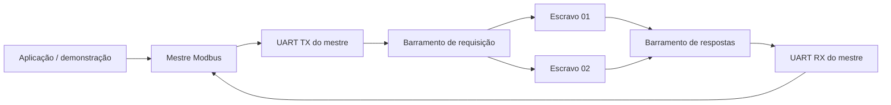
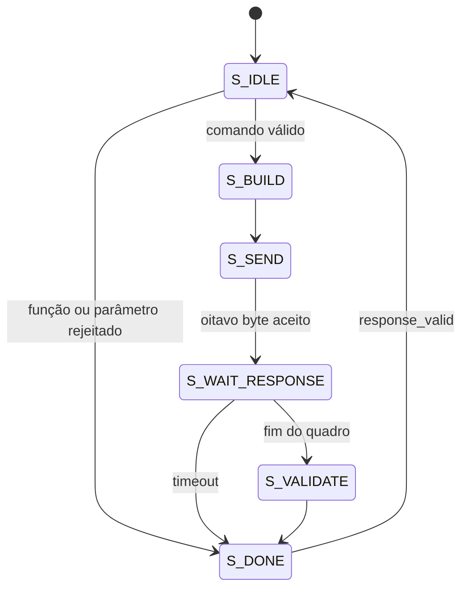

# Guia de estudo e apresentação - Rede Modbus RTU simulada em FPGA

## 1. Mensagem central do trabalho

O projeto demonstra que uma rede Modbus RTU pode ser descrita integralmente em
hardware digital, usando SystemVerilog e uma FPGA, sem depender de um
processador executando software.

A implementação atual contém:

- um mestre Modbus RTU;
- dois escravos internos, com endereços `0x01` e `0x02`;
- um banco independente de 64 holding registers para cada escravo;
- UART, geração de baud rate e detecção de fim de quadro;
- CRC-16 Modbus;
- suporte às funções FC03 e FC06;
- tratamento de exceções, parâmetros inválidos, overflow, CRC incorreto e
  timeout;
- testbenches unitários, de integração e da demonstração na DE10-Standard.

A contribuição didática é permitir observar uma transação completa, desde o
comando entregue ao mestre até a resposta validada, incluindo o tráfego serial
e o comportamento independente dos escravos.

## 2. Roteiro sugerido para a apresentação

O roteiro abaixo foi pensado para aproximadamente 15 a 18 minutos. A parte do
mestre ocupa cerca de 4 minutos e pode ser apresentada pelo responsável por
esse módulo.

### Slide 1 - Título e integrantes

No slide:

- Implementação de uma Rede Modbus RTU Simulada em FPGA
- SystemVerilog, Cyclone V e DE10-Standard
- nomes dos integrantes

Fala sugerida:

> Este trabalho apresenta uma rede Modbus RTU implementada em lógica digital.
> O sistema reúne um mestre e dois escravos dentro da FPGA, permitindo validar
> leitura, escrita, endereçamento, CRC, exceções e timeout sem equipamentos
> Modbus externos.

### Slide 2 - Problema e motivação

No slide:

- comunicação industrial exige confiabilidade e previsibilidade;
- implementações por software dependem de interrupções e tempo de CPU;
- FPGA oferece paralelismo e temporização determinística;
- desafio: obter uma arquitetura modular e verificável.

Fala sugerida:

> O Modbus RTU possui regras de quadro e temporização. Em software, outras
> tarefas podem interferir no atendimento desses tempos. Na FPGA, UART,
> temporizadores, CRC e máquinas de estados funcionam como circuitos
> dedicados e concorrentes.

Evite afirmar que o projeto provou desempenho superior a um microcontrolador,
pois não foi realizado um benchmark comparativo. A formulação segura é que a
FPGA oferece potencial de determinismo e paralelismo por construção.

### Slide 3 - Objetivo

No slide:

- implementar uma rede Modbus RTU em SystemVerilog;
- suportar FC03 e FC06;
- usar múltiplos escravos com memórias independentes;
- validar casos normais e falhas;
- sintetizar para a DE10-Standard.

Fala sugerida:

> O objetivo não foi criar apenas um escravo isolado. Foi integrar todos os
> elementos de uma pequena rede: mestre, transporte serial, barramento,
> escravos, registradores e mecanismos de verificação.

### Slide 4 - Fundamentos do Modbus RTU

No slide:

- modelo de consulta e resposta;
- somente o mestre inicia uma transação;
- endereço identifica o escravo;
- RTU delimita quadros por silêncio;
- CRC-16 protege a integridade.

Fala sugerida:

> O mestre escolhe um endereço e envia uma requisição. Todos os escravos podem
> observar o barramento, mas apenas o endereço correspondente responde. Um
> quadro com CRC inválido ou destinado a outro endereço é descartado.

### Slide 5 - Estrutura do quadro

No slide:

```text
Endereço | Função | Dados | CRC baixo | CRC alto
  1 byte | 1 byte |  N    |  1 byte   |  1 byte
```

Exemplos:

```text
FC06: 01 06 00 02 AB CD 96 AF
FC03: 01 03 00 02 00 01 25 CA
```

Fala sugerida:

> No exemplo FC06, o mestre solicita ao escravo 1 a escrita de ABCD no
> registrador 2. Os seis primeiros bytes formam o conteúdo protegido, e os
> bytes 96 e AF são o CRC transmitido em ordem low byte e high byte.

### Slide 6 - Arquitetura em camadas

No slide:



Explique as três camadas:

1. transporte: UART, baud tick e `frame_timer`;
2. protocolo: mestre, escravos, CRC e registradores;
3. integração: barramento interno, seleção dos escravos e interface da placa.

### Slide 7 - Funções implementadas

No slide:

| Função | Operação | Resposta normal |
| --- | --- | --- |
| FC03 | leitura de holding registers | byte count e dados |
| FC06 | escrita de um holding register | eco do endereço e valor |

Fala sugerida:

> Na FC03, o mestre verifica se a quantidade de bytes é o dobro da quantidade
> de registradores solicitada. Na FC06, ele exige que a resposta repita
> exatamente o endereço do registrador e o valor enviados.

### Slide 8 - O mestre Modbus RTU

No slide:

- recebe o comando da aplicação;
- rejeita parâmetros inválidos antes de transmitir;
- monta o quadro de oito bytes;
- usa handshake com a UART;
- aguarda e armazena a resposta;
- verifica CRC, endereço, função e conteúdo;
- encerra com um status explícito.

Fala sugerida:

> O mestre é o controlador da transação. Ele não apenas envia bytes. Ele
> conserva os dados do comando, controla o montador de quadro, respeita a
> disponibilidade da UART, mede o timeout e só libera uma resposta após todas
> as validações.

### Slide 9 - Máquina de estados do mestre

No slide:



Resumo oral:

- `S_IDLE`: mestre livre e `cmd_ready=1`;
- `S_BUILD`: inicia o montador;
- `S_SEND`: transmite os oito bytes com `tx_valid/tx_ready`;
- `S_WAIT_RESPONSE`: recebe bytes e atualiza CRC e timeout;
- `S_VALIDATE`: classifica a resposta;
- `S_DONE`: pulsa `response_valid` e retorna ao estado inicial.

### Slide 10 - Múltiplos escravos

No slide:

- `NUM_SLAVES=2`;
- endereços `0x01` e `0x02`;
- requisição distribuída aos dois;
- apenas o escravo endereçado transmite;
- bancos de registradores independentes;
- endereço `0x03` usado para timeout;
- `slave_bus_collision` monitora transmissão simultânea.

Fala sugerida:

> O endereço não seleciona um mux antes da recepção. Os dois escravos recebem o
> quadro e verificam endereço e CRC. Apenas o escravo correspondente constrói a
> resposta. Isso representa de forma mais fiel um barramento multiponto.

### Slide 11 - Verificação

No slide:

- teste unitário do mestre;
- teste de integração de um escravo;
- teste de integração multi-escravo;
- teste direto de CRC inválido;
- teste do fluxo automático da placa.

Resultados confirmados:

```text
Todos os testes do mestre Modbus foram aprovados.
PASS: 6 testes de integração Modbus RTU aprovados.
PASS: 12 testes multi-escravo Modbus RTU aprovados.
PASS: CRC inválido descartado sem resposta e sem escrita.
PASS: fluxo automático da DE10-Standard aprovado na etapa D.
```

### Slide 12 - Demonstração na FPGA

No slide:

- `SW8`: seleciona escravo 1 ou 2;
- `KEY1`: FC06 no registrador 2;
- `KEY2`: FC03 no registrador 2;
- `KEY3`: inicia ou avança o autoteste;
- `SW9`: guiado ou automático;
- displays: etapa/endereço, status e dado;
- `LEDR5`: aprovação;
- `LEDR6`: falha;
- `LEDR7`: colisão.

Roteiro recomendado:

1. Use o modo manual para escrever valores diferentes no registrador 2 de cada
   escravo.
2. Leia novamente cada escravo e mostre que os valores foram preservados.
3. Execute o autoteste guiado, explicando as etapas principais.
4. Mostre o timeout da etapa `D`.
5. Finalize apontando `LEDR5=1`, `LEDR6=0` e `LEDR7=0`.

### Slide 13 - Resultados e limitações

No slide:

Resultados:

- comunicação FC03/FC06 funcional;
- isolamento entre os bancos;
- CRC e exceções corretamente classificados;
- timeout para escravo inexistente;
- ausência de colisão no fluxo normal;
- síntese lógica do projeto concluída sem erros.

Limitações:

- barramento atualmente interno;
- ausência de transceptor RS-485 físico;
- somente FC03 e FC06;
- endereços consecutivos a partir de um endereço-base;
- não foram modelados ruído e atrasos analógicos do meio físico.

### Slide 14 - Conclusão e trabalhos futuros

Fala sugerida:

> A arquitetura comprovou funcionalmente que mestre, barramento e dois
> escravos podem operar dentro da FPGA com módulos reutilizáveis. O mestre
> controla integralmente a transação e diferencia sucesso, exceção, corrupção
> e ausência de resposta. Como continuidade, podem ser adicionados um
> transceptor RS-485, novas funções Modbus, endereços configuráveis e testes em
> uma rede física.

## 3. Estudo aprofundado da parte do mestre

### 3.1 Arquivos envolvidos

| Arquivo | Responsabilidade |
| --- | --- |
| `modbus_defs_pkg.sv` | funções suportadas, limite FC03 e enumeração de status |
| `modbus_crc_pkg.sv` | função incremental `crc16_update` |
| `master_frame_builder.sv` | montagem e entrega dos oito bytes da requisição |
| `modbus_master_fsm.sv` | controle, recepção, timeout e validação |
| `tb_modbus_master_fsm.sv` | estímulos e verificações automáticas |

### 3.2 Interface de comando

O comando usa handshake:

- `cmd_valid`: a aplicação informa que há um comando;
- `cmd_ready`: o mestre informa que está em `S_IDLE`;
- a aceitação ocorre quando os dois estão ativos.

Campos armazenados:

- `cmd_slave_addr`: endereço do escravo;
- `cmd_function`: `0x03` ou `0x06`;
- `cmd_register_addr`: primeiro registrador ou registrador de escrita;
- `cmd_write_data`: valor usado na FC06;
- `cmd_quantity`: quantidade usada na FC03.

Ao aceitar o comando, o mestre copia os campos para `selected_slave`,
`selected_function`, `selected_register` e `selected_value`. Isso impede que
uma alteração posterior nas entradas modifique uma transação em andamento.

### 3.3 Validação local antes da transmissão

Ainda em `S_IDLE`, o mestre evita transmitir comandos que já são sabidamente
inválidos:

- função diferente de FC03 ou FC06: `STATUS_UNSUPPORTED`;
- FC03 com quantidade zero;
- FC03 com quantidade maior que 125;
- FC03 acima de `MAX_READ_REGISTERS`: `STATUS_INVALID_PARAM`.

Essa validação economiza tempo de barramento e diferencia erro de uso da
interface de uma exceção produzida pelo escravo.

### 3.4 Montagem do quadro

O `master_frame_builder` organiza:

| Índice | Conteúdo |
| --- | --- |
| 0 | endereço do escravo |
| 1 | função |
| 2 | endereço do registrador, byte alto |
| 3 | endereço do registrador, byte baixo |
| 4 | valor ou quantidade, byte alto |
| 5 | valor ou quantidade, byte baixo |
| 6 | CRC baixo |
| 7 | CRC alto |

O CRC começa em `0xFFFF` e utiliza o polinômio refletido `0xA001`. O montador
calcula o CRC sobre os seis primeiros bytes.

### 3.5 Handshake com a UART

O mestre apresenta `tx_valid` enquanto há um byte válido. A UART apresenta
`tx_ready` quando pode aceitá-lo. O índice somente avança quando:

```text
tx_valid && tx_ready
```

Essa regra é importante porque a UART permanece ocupada durante a transmissão
dos bits de start, dados e stop. Sem handshake, o mestre poderia avançar e
perder bytes.

### 3.6 Recepção e timeout

Em `S_WAIT_RESPONSE`:

- cada pulso `rx_valid` grava um byte no `response_buffer`;
- o CRC acumulado é atualizado;
- o contador de timeout volta a zero a cada byte;
- `rx_frame_end` leva a FSM para validação;
- ausência prolongada de bytes resulta em `STATUS_TIMEOUT`;
- bytes além do buffer ativam `response_overflow`.

O reinício do timeout após cada byte permite detectar tanto ausência total de
resposta quanto uma resposta que começou e ficou incompleta.

### 3.7 Ordem da validação

A ordem usada pelo mestre evita interpretar dados corrompidos:

1. verificar overflow;
2. exigir comprimento mínimo;
3. verificar se o CRC acumulado terminou em `0x0000`;
4. comparar o endereço com o escravo selecionado;
5. identificar resposta de exceção;
6. comparar a função;
7. aplicar as regras específicas de FC03 ou FC06.

Uma resposta de exceção só é aceita depois da validação do CRC e do endereço.

### 3.8 Validação da FC03

O mestre verifica:

- byte count diferente de zero;
- byte count par;
- byte count igual a `quantidade solicitada x 2`;
- comprimento total igual a `byte count + 5`;
- quantidade retornada dentro do buffer configurado.

Os registradores são armazenados em `response_registers`. A aplicação também
pode selecionar um resultado por:

- `response_register_read_index`;
- `response_register_read_data`;
- `response_register_read_valid`.

`response_data` contém o primeiro registrador, facilitando leituras simples.

### 3.9 Validação da FC06

A resposta normal da FC06 deve ter oito bytes. O mestre compara:

- endereço do registrador retornado com `selected_register`;
- valor retornado com `selected_value`.

CRC correto não é suficiente. Um eco com outro endereço ou valor é classificado
como `STATUS_INVALID`.

### 3.10 Status do mestre

| Valor | Status | Significado |
| --- | --- | --- |
| 0 | `STATUS_OK` | operação válida |
| 1 | `STATUS_EXCEPTION` | escravo respondeu com exceção |
| 2 | `STATUS_CRC_ERROR` | resposta corrompida |
| 3 | `STATUS_TIMEOUT` | resposta ausente ou incompleta |
| 4 | `STATUS_INVALID` | formato, endereço, função ou eco incoerente |
| 5 | `STATUS_OVERFLOW` | resposta maior que o buffer |
| 6 | `STATUS_UNSUPPORTED` | função rejeitada antes da transmissão |
| 7 | `STATUS_INVALID_PARAM` | quantidade FC03 inválida |

### 3.11 Testes unitários do mestre

O testbench cobre:

- FC03 com um registrador;
- FC03 com múltiplos registradores;
- leitura da resposta por índice;
- FC06 com eco válido;
- transmissão com `tx_ready` intermitente;
- exceção `0x02`;
- exceção `0x0B`;
- CRC incorreto;
- endereço incorreto;
- função de resposta incorreta;
- quadro curto;
- byte count inválido;
- overflow;
- função não suportada;
- quantidade zero;
- quantidade acima de 125;
- timeout após resposta parcial;
- timeout sem nenhum byte.

Resultado obtido no ModelSim 10.5b:

```text
Todos os testes do mestre Modbus foram aprovados.
Errors: 0, Warnings: 0
```

## 4. Perguntas prováveis e respostas

### Por que existe somente um mestre?

O modelo serial adotado é mestre-escravo. Somente o mestre inicia transações,
evitando arbitragem entre vários iniciadores.

### Como o mestre escolhe o escravo?

O endereço é o primeiro byte do quadro. Todos os escravos recebem a
requisição, mas somente aquele cujo `slave_id` coincide continua o
processamento e transmite.

### Como se garante que os bancos são independentes?

Cada instância de escravo possui sua própria instância de
`modbus_register_file`. Os testes escrevem valores diferentes no mesmo
endereço dos escravos 1 e 2 e depois leem ambos.

### Por que a linha de resposta usa uma operação AND?

A UART permanece em nível lógico alto quando ociosa. Um escravo ativo produz
os níveis do quadro enquanto os demais permanecem em 1. A redução AND preserva
o sinal do único transmissor. Se dois transmissores ficarem ativos,
`slave_bus_collision` sinaliza a condição.

### Qual é a diferença entre exceção e timeout?

Exceção significa que um escravo respondeu com um quadro Modbus válido, mas não
executou a operação. Timeout significa que o mestre não recebeu uma resposta
completa dentro do limite.

### Por que o CRC válido termina em zero na recepção?

O mestre aplica o mesmo algoritmo sobre os dados e os dois bytes de CRC
recebidos. Para um quadro Modbus íntegro, o resto acumulado é `0x0000`.

### O projeto já é uma rede RS-485 física?

Não. Ele simula o comportamento lógico e serial da rede dentro da FPGA. Uma
rede física exige um transceptor RS-485 de 3,3 V e controle de direção.

### A FPGA foi usada apenas para mostrar valores mockados?

Não. A interface da placa apenas gera comandos e exibe resultados. A transação
passa pelo mestre, montador de quadro, CRC, UARTs, temporizadores, escravo
endereçado e banco de registradores real sintetizado.

### O que acontece quando o endereço `0x03` é consultado?

Nenhum escravo reconhece o quadro. Não há resposta e o contador do mestre
termina em `STATUS_TIMEOUT`.

## 5. Pontos do PDF que precisam ser atualizados

Antes da entrega final do trabalho escrito:

1. preencher Resumo, Abstract, lista de abreviaturas e estrutura do trabalho;
2. preencher integralmente Resultados e Avaliação, atualmente vazios;
3. preencher a Conclusão, atualmente vazia;
4. atualizar de três para dois escravos onde o número for apresentado;
5. remover a afirmação de que a execução do ModelSim ainda depende de
   verificação de licença;
6. inserir os resultados reais dos testbenches;
7. não afirmar que ruído, contenção e turnaround RS-485 foram modelados, pois
   esses efeitos ainda não fazem parte da implementação;
8. corrigir a numeração repetida das subseções `4.1.1`;
9. corrigir o trecho corrompido “papel de ú rx_data...” na página 30;
10. substituir textos em vermelho, marcadores e apêndices ainda vazios;
11. registrar que a síntese lógica do Cyclone V passou, separando esse
    resultado da compilação completa com fitting e análise de temporização;
12. atualizar o sumário depois das correções.

## 6. Checklist de estudo da parte do mestre

Antes da apresentação, seja capaz de explicar sem consultar o código:

- o que inicia uma transação;
- os seis estados da FSM e a condição de saída de cada um;
- a composição dos oito bytes da FC03 e FC06;
- por que o CRC é transmitido low byte primeiro;
- como funciona `tx_valid/tx_ready`;
- como `rx_valid` e `rx_frame_end` são usados;
- por que o timeout é reiniciado a cada byte;
- quais campos são verificados na FC03;
- por que a FC06 precisa validar o eco;
- a diferença entre `STATUS_EXCEPTION`, `STATUS_INVALID` e
  `STATUS_TIMEOUT`;
- como o mestre trabalha com dois escravos sem duplicar sua FSM;
- quais testes comprovam a robustez do módulo.

