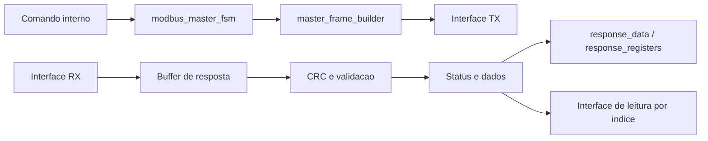

# Mestre Modbus RTU em FPGA

## Visao geral

Este conjunto de arquivos implementa e verifica um mestre Modbus RTU em SystemVerilog. O mestre recebe comandos internos, monta quadros Modbus RTU, envia os bytes pela interface de transmissao, aguarda a resposta, valida CRC, trata excecoes, detecta timeout e disponibiliza os dados recebidos.

## Versao final entregue

Esta versao fecha a parte do Membro 2, Mestre Modbus RTU, com codigo RTL, testbench, pacotes compartilhados e documentacao tecnica. A implementacao contempla as funcoes Modbus `03` e `06`, validacao de CRC, timeout, excecoes, resposta invalida, overflow, parametros invalidos e leitura sistemica de multiplos registradores.

As limitacoes existentes sao limitacoes de escopo, nao pendencias da parte do mestre:

- a camada fisica UART/RS-485 deve ser integrada pelos blocos de transporte do projeto;
- o mestre suporta apenas as funcoes `03` e `06`, conforme escopo definido;
- a validacao completa por `vsim` depende de uma licenca funcional do simulador.

## Arquivos

| Arquivo | Funcao |
|---|---|
| `modbus_defs_pkg.sv` | Define codigos de funcao, limite de leitura e enum de status |
| `modbus_crc_pkg.sv` | Implementa a funcao compartilhada de CRC-16 Modbus |
| `master_frame_builder.sv` | Monta o quadro de requisicao de 8 bytes e inclui o CRC |
| `modbus_master_fsm.sv` | Controla a transacao Modbus RTU por maquina de estados |
| `tb_modbus_master_fsm.sv` | Verifica o mestre por simulacao com cenarios validos e de erro |
| `EXPLICACAO_MESTRE_MODBUS_RTU.md` | Explicacao didatica para estudo e apresentacao |
| `TABELA_VERIFICACAO_MESTRE_MODBUS_RTU.md` | Tabela de verificacao pronta para relatorio |

## Ordem de compilacao

Compile os arquivos nesta ordem:

```text
modbus_defs_pkg.sv
modbus_crc_pkg.sv
master_frame_builder.sv
modbus_master_fsm.sv
tb_modbus_master_fsm.sv
```

Exemplo com Questa/ModelSim:

```powershell
vlog -sv modbus_defs_pkg.sv modbus_crc_pkg.sv master_frame_builder.sv modbus_master_fsm.sv tb_modbus_master_fsm.sv
vsim -c tb_modbus_master_fsm -do "run -all"
```

## Arquitetura resumida



O bloco `modbus_master_fsm` coordena a transacao. O `master_frame_builder` monta a requisicao e calcula o CRC da transmissao. Na recepcao, a FSM armazena os bytes recebidos, atualiza o CRC, valida a resposta e disponibiliza status, excecao e dados lidos.

## Funcoes Modbus suportadas

| Funcao | Nome | Suporte |
|---:|---|---|
| `03` | Read Holding Registers | Leitura de um ou mais registradores |
| `06` | Write Single Register | Escrita de um unico registrador |

## Status de resposta

| Status | Codigo | Significado |
|---|---:|---|
| `STATUS_OK` | `0` | Resposta validada com sucesso |
| `STATUS_EXCEPTION` | `1` | Escravo retornou excecao Modbus |
| `STATUS_CRC_ERROR` | `2` | CRC da resposta invalido |
| `STATUS_TIMEOUT` | `3` | Ausencia de resposta ou resposta parcial sem fim de quadro |
| `STATUS_INVALID` | `4` | Quadro recebido fora do formato esperado |
| `STATUS_OVERFLOW` | `5` | Resposta excedeu o limite local de armazenamento |
| `STATUS_UNSUPPORTED` | `6` | Funcao Modbus nao suportada |
| `STATUS_INVALID_PARAM` | `7` | Parametro de comando invalido |

## Interface de leitura FC03

A resposta da funcao `03` fica disponivel de duas formas:

- `response_data`: mantem o primeiro registrador lido, para compatibilidade.
- `response_registers`: vetor com todos os registradores lidos.
- `response_register_count`: quantidade de registradores validos.
- `response_register_read_index`: indice solicitado por outro modulo.
- `response_register_read_data`: dado do indice solicitado.
- `response_register_read_valid`: indica se o indice solicitado e valido.

Essa interface por indice facilita a integracao com outros blocos, pois funciona como uma pequena memoria de leitura.

## Limitacoes conhecidas

- O projeto implementa apenas as funcoes `03` e `06`.
- A camada UART/RS-485 fisica nao faz parte deste bloco; o mestre usa sinais abstratos `tx_data`, `tx_valid`, `tx_ready`, `rx_data`, `rx_valid` e `rx_frame_end`.
- O limite de registradores lidos e configurado por `MAX_READ_REGISTERS`, respeitando tambem o limite Modbus de 125 registradores.
- A simulacao completa depende de uma licenca funcional do simulador. Neste ambiente, a compilacao com `vlog` passou sem erros, mas o `vsim` foi bloqueado por licenca.

## Resultado esperado

Quando executado em um simulador com licenca valida, o testbench deve finalizar com:

```text
Todos os testes do mestre Modbus foram aprovados.
```
